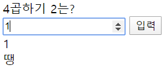

#Practice 1 - Vue Start

#1. Vue 개념 - Data Driven!!!
>1. Vue 문법
>>1. 보간법(Interpolation)
>>>- Mustach 문법 사용
>>>HTML 코드 부분
>>>```html
>>>    <div>{{value}}</div>
>>>```
>>>JS 코드 부분(script) - Vue 객체 일부
>>>```javascript
>>>const app = new Vue({
>>>        	el: "#root",
>>>        	data: {
>>>            	first: Math.ceil(Math.random() * 9),
>>>            	second: Math.ceil(Math.random() * 9),
>>>            	value: '',
>>>            	result: '',
>>>        	},
>>>        }
>>>```
>>>위 예시와 같이 vue 인스턴스 내부의 Data 중 실제 화면에 표시하고자 하는 변수 이름을 중괄호 사이에 넣어줌으로써 화면에 표시한다.
>>>vue 인스턴스 내부 데이터 값이 변하면 화면의 값은 "자동"으로 변한다.
>>>
>>2. 디렉티브(Directive)
>>>- v- 접두어가 있는 특수한 속성. 
>>>- 디렉티브의 속성 값이 변경 되면 DOM과 "바인딩" 하여 DOM을 변경하는 역할을 함.
>>>1. v-on:submit: form 태그에 쓰이며 submit 버튼이 눌리면 ""내부의 함수를 실행. v-on:은 @로 대체가 가능하다.
>>>HTML 코드 부분
>>>```html
>>>    <form v-on:submit="onSubmitForm">
>>>```
>>>JS 코드 부분(script) - Vue 객체 일부
>>>```javascript
>>>methods: {
>>>            onSubmitForm(e){
>>>                // form은 submit하면 자동으로 페이지 새로고침을 하는데
>>>                // 싱글 페이지므로 새로고침을 막기위해 사용
>>>                e.preventDefault();
>>>            },
>>>```
>>>From 내부의 submit 버튼을 누르면 Vue 인스턴스의 method에 정의한 onSubmitForm() 메소드를 실행한다.
>>>
>>>2. v-model: form input을 Vue 인스턴스의 변수와 연결할 때 사용
>>>HTML 코드 부분
>>>```html
>>>    <input type="number" ref="answer" v-model="value">
>>>```
>>>JS 코드 부분(script) - Vue 객체 일부
>>>```javascript
>>>data: {
>>>            first: Math.ceil(Math.random() * 9),
>>>            second: Math.ceil(Math.random() * 9),
>>>            value: '',
>>>            result: '',
>>>        },
>>>```
>>>Form 내부의 input 태그 값을 Vue 인스턴스의 value라는 변수와 연결해 준다.
>>>
>>>3. ref
>>>HTML 코드 부분
>>>```html
>>><input type="number" ref="answer" v-model="value">
>>>```
>>>JS 코드 부분(script) - Vue 객체 일부
>>>```javascript
>>>this.$refs.answer.focus();
>>>```
>>>submit 버튼을 누르고 갱신이 되면 사용자 편의를 위해 커서를 input태그 내부에 위치시켜야 하므로 참조하기 위해 answer라는 이름으로 ref를 사용한다.
>>>접근할 때는 $refs를 사용하며, focus() 메서드를 통해 커서를 위치시킨다.

>2. Vue CDN
>>- Vue는 JQuery나 Bootstrap과 같이 설치하지 않고 CDN으로 load하여 사용할 수 있다.
>>- 이 경우, 경량화된 부분만을 불러와 사용하므로 일부 기능을 사용할 수 없으며, 자동으로 vue 구조를 생성해주는 기능이 없기 때문에 수동으로 전부 타이핑하며 프로그래밍 해야 한다.
>>```javascript
>><script src="https://cdn.jsdelivr.net/npm/vue/dist/vue.js"></script>
>>```

>3. Vue 인스턴스
>>- 모든 Vue 앱은 Vue 인스턴스를 생성함으로써 시작된다.
>>HTML 코드 부분
>>```html
>><!DOCTYPE html>
>><html>
>><head>
>>    <meta charset="UTF-8">
>>    <title>구구단-Vue기본 구조, 디렉터리</title>
>>    <script src="https://cdn.jsdelivr.net/npm/vue/dist/vue.js"></script>
>></head>
>><body>
>>	<div id="root">
>>	</div>
>></body>
>></html>
>>```
>>JS 코드 부분(script) - Vue 인스턴스 구조
>>```javascript
>><script>
>>    const app = new Vue({
>>        el: "#root",
>>        data: {
>>            value: '',
>>        },
>>        methods: {
>>            onSubmitForm(e){
>>                }
>>            },
>>        },
>>    });
>></script>
>>```
>>- el: html 내부의 어떤 div를 컨트롤 할 것인지.
>>- data: 화면에서 <u>실제</u> 바뀌는 <u>data</u>들. 여기에는 초기값을 써준다.
>>- methods: 버튼 클릭시 실행할 메소드 등을 정의한다. methods에서 Vue 인스턴스의 data에 접근하려면 <u>this</u>를 앞에 꼭 붙여줘야 한다.
>>- 이 외에도 여러 속성이 있고, 필요할 때마다 찾아가면서 학습할 것.

#2. Javascript 문법
>1. Math.ceil
>```javascript
>this.first = Math.ceil(Math.random() * 9)
>```
>first라는 변수에 1~9까지의 숫자 중 하나를 할당.
>>- math.ceil: 소숫점 이하를 올림한다.
>>- math.random: 0~1 사이의 난수를 생성한다.

#3. 실행 화면
>1. 초기 화면
>
>2. 오답 화면
>
>3. 정답 화면
>
