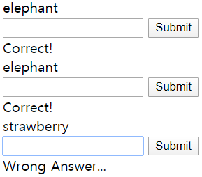

#Practice 2 - Component, props

#1. Vue 개념
>1. 컴포넌트(Component)
>>- 기본 html 엘리먼트를 확장하여 코드를 캡슐화 한 것. 재사용이 가능하다.
>>- Vue 인스턴스 이기도 하다.
>>1. 기본 구조
>>```javascript
>><script>
>>    //Global component
>>    Vue.component("word-relay", {
>>        // template는 무조건 최상의 div 하나로 묶여야함!!!!
>>        template: `
>>            <div>
>>                <div>{{problem}}</div>
>>                <div>{{result}}</div>
>>            </div>
>>            `,
>>        //각 경우마다 다른 데이터를 넣을때 그것을 쓴다고 선언
>>        props: ['startWord'],
>>        // 이 부분만 기존의 data 부분과 다름! 메소드 형태로 만들어야함
>>        data() {
>>            return{
>>                problem: this.startWord,
>>            }
>>        },
>>        methods: {
>>            onClickSubmit(e){
>>                e.preventDefault();
>>            }
>>        },
>>    })
>></script>
>>>```
>>>- template: html코드가 들어가는 부분 모든 태그는 무조건 가장 상위의 <u>div태그 하나로 묶여야 한다</u>.
>>>- data: 기존 Vue 인스턴스 구조와 달리 각 컴포넌트 별로 사용되는 data가 다를 수 있으므로 <u>data()와 같이 메소드 형태로 구현</u>하며, 내부에서 <u>return을 필수</u>로 해주어야 한다.
>>>- props: 같은 컴포넌트를 여러 번 호출한다 해도 일부분은 다르게 이용하고 싶을 수 있다. 그럴 때, 이용하는 것이 props 옵션이다.
>>```html
>><div id="root">
>>    <word-relay start-word="apple"></word-relay>
>>    <word-relay start-word="grape"></word-relay>
>>    <word-relay start-word="strawberry"></word-relay>
</div>
>>```
>>>- 컴포넌트를 호출할 때, start-word를 서로다른 데이터로 사용하고자 옵션으로 준다.
>>```javascript
>>props: ['startWord'],
>>data() {
>>            return{
>>                problem: this.startWord,
>>                answer: '',
>>                result: '',
>>                info: '이 버튼을 누르면 정답이 제출됩니다.',
>>            }
>>        },
>>```
>>다음과 같이 props 옵션으로 startWord를 받아서 컴포넌트 내부에서 사용할 수 있게 한다. <u>data애서 props값에 접근할 때는 앞에 this를 붙여야 한다.</u>
>>
>>2. 호출
>>```html
>><word-relay></word-relay>
>>```
>>html코드의 안에서 위와 같이 호출한다.
>>
>>3. 컴포넌트 사용시 Vue 인스턴스
>>>```javascript
>>><script>
    const app = new Vue({
        el: "#root",
    });
</script>
>>>```
>>>컴포넌트 외부에 다음과 같이 Vue 인스턴스를 생성하여 id가 root인 div를 컨트롤 해준다.
>>><u>Vue 인스턴스 선언부 위에 컴포넌트를 선언해야 한다.</u>

>2. v-bind
>>- 콜론 내부에 '전달 인자'를 사용하며, HTML 속성을 갱신할 때 사용한다.
>>- 컴포넌트의 data() 내부 변수와 매칭.
>>```html
>><button type="submit" v-bind:title="info">Submit</button>
>>```
>>```javascript
>>data() {
            return{
                problem: this.startWord,
                answer: '',
                result: '',
                info: '이 버튼을 누르면 정답이 제출됩니다.',
            }
        },
>>```
>>제출 버튼에 커서를 올리면 info에 해당하는 '이 버튼을~'이 보이게한다(title 속성).


#2. Javascript 문법
>- 문자열 파싱
>>1. 배열 이용
>>```javascript
>>this.problem[this.problem.length - 1]
>>```
>>problem이라는 문자열에 배열 index를 사용하듯이 접근하여 마지막 문자를 받아온다.
>>2. method 이용
>>```javascript
>>this.problem.substr(this.problem.length - 1)
>>```
>>substr 메서드를 이용하여 맨 마지막 문자를 리턴. 시작 index를 변수로 넣어주었다.


#3. 실행 화면
>1. 초기 화면
>
>2. 정답 화면
>