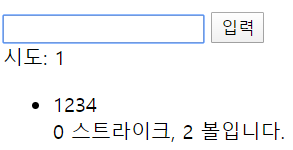

#pr_3 - Webpack

##1. Vue 문법
1. Vue파일
	- 기존에는 컴포넌트를 만들 때, Vue.component{컴포넌트 이름, {}} 구조로 컴포넌트를 만들고, Vue 인스턴스를 생성하여 컨트롤 할 div의 id를 mount 해주어야 했다.
	- Webpack을 사용하기 위해 확장자가 vue인 파일을 만들고 그곳에 컴포넌트를 구현한다.
	```javascript
    <template>
    <div>
        <h1>{{result}}</h1>
	<!-- v-on을 @로 대체할 수 있고, prevent 추가함으로써 디폴트 속성 무력화 -->
        <form @submit.prevent="onSubmitForm">
            <input minlength="4" maxlength="4" v-model="value" ref="answer">
            <button type="submit">입력</button>
        </form>
        <div>시도: {{tries.length}}</div>
        <ul>
            <li v-for="t in tries">
                <div>{{t.try}}</div>
                <div>{{t.result}}</div>
            </li>
        </ul>
    </div>
	</template>
    
	<script>
    export default {
        data() {
            return{
            }
        },
        methods: {
        },
    };
	</script>
    
	<style>
	</style>
    ```
    - 위와 같이 template, script, style의 세 부분으로 구성된다.
2. v-for: item in itmes와 같이 써야 하며, 리스트를 출력할 수 있게 한다.
```html
<ul>
	<li v-for="t in tries">
		<div>{{t.try}}</div>
		<div>{{t.result}}</div>
	</li>
</ul>
```
위와 같이 사용할 수 있으며, try in tries로 사용하려 했으나 try는 예약어이기 때문에 t로 대체하였다.

##2. Webpack
1. package.json
```json
{
  "name": "number-baseball",
  "version": "1.0.0",
  "description": "",
  "main": "main.js",
  "scripts": {
    "build": "webpack"
  },
  "author": "",
  "license": "ISC",
  "dependencies": {
    "vue": "^2.6.11"
  },
  "devDependencies": {
    "vue-loader": "^15.8.3",
    "vue-template-compiler": "^2.6.11",
    "webpack": "^4.41.5",
    "webpack-cli": "^3.3.10"
  }
}
```
	- 위와 같은 구조로 이루어져 있으며, name은 어플리케이션 이름, scripts에는 사용할 명령어(여기서는 build 명령어가 들어오면 webpack을 사용), dependencies에는 사용하는 모듈, devDependencies에는 개발시에만 사용하는 모듈이 들어가 있다.
	- dependencies의 vue와 devDependencies의 vue-template-compiler의 버전이 일치해야 한다.

2. main.js
```javascript
import Vue from 'vue';
import numberBaseball from './numberBaseball';
new Vue(numberBaseball).$mount("#root");
```
	- 위와 같이 vue 모듈에서 Vue를 불러오고, numberbaseball.vue 파일을 불러와 사용한다.
	- Vue 인스턴스를 생성해주고, 생성할 때 불러온 vue 컴포넌트를 넣어준다. 이후, 컨트롤 할 div id에 마운트 해준다.

3. webpack.config.js
```javascript
const VueLoaderPlugin = require('vue-loader/lib/plugin');
const path = require('path');
module.exports = {
    mode: 'development',
    devtool: "eval",
    resolve: {
        extensions: ['.js', '.vue'],
    },
    entry: {
        app: path.join(__dirname, 'main.js'),
    },
    module: {
        rules: [{
            test: /\.vue$/,
            loader: 'vue-loader',
        }],
    },
    plugins: [
        new VueLoaderPlugin(),
    ],
    output: {
        filename: "[name].js",
        path: path.join(__dirname, 'dist'),
    },
};
```
	- webpack으로 빌드할 때 필요한 정보들을 담고 있다. entry, module, plugins, output은 필수요소이다.
	1. resolve: 어떤 형태의 파일을 읽어들일 것인지 명시한다. 여기서는 js와 vue 파일을 읽을것이므로 해당 파일들은 확장자를 써주지 않아도 된다.
	2. entry: webapck으로 빌드된 파일들 중에 제일 먼저 빌드될 파일의 위치를 알려준다.
	3. module: webpack은 __JS만을 빌드하기 때문에__ js가 아닌 파일을 만났을 때, js로 바꾸어주는 규칙을 명시해 주어야 한다. 여기서는 vue로 끝나는 파일을 만나면 vue-loader를 통해 js로 바꿔주도록 하였다.
	4. plugins: module의 rules에서 명시한 vue-loader가 플러그인이 필요하므로 해당 플러그인을 써준다.
	5. webpack으로 빌드된 파일이 저장될 이름과 위치를 지정해준다. [name]이라고 쓴 부분은 entry의 app부분과 일치되어 app.js가 dist 폴더 내에 저장된다.

4. Load
	- Webpack은 main.js와 numberBaseball.vue를 합쳐서 dist 폴더에 app.js라는 하나의 파일로 만들어 낸다.
	- numberBaseball.html에서는 해당 파일을 아래와 같이 불러와 랜더링한다.
	```html
    <!DOCTYPE html>
	<html>
    <head>
        <meta charset="UTF-8">
        <title>숫자 야구-Webpack</title>
    </head>
    <body>
        <div id="root"></div>
        <script src="./dist/app.js"></script>
    </body>
	</html>
    ```

##3. JS 문법
1. Math.floor: 소숫점 이하를 버린다.
```javascript
const getNumbers = () => {
        const candidates = [1, 2, 3, 4, 5, 6, 7, 8, 9];
        const array = [];
        for(let i = 0; i < 4; i += 1){
            const chosen = candidates.splice(Math.floor(Math.random() * (9 - i)), 1)[0];
            array.push(chosen);
        }
        return array;
    };
```
	- 1~9까지 4개의 수를 중복 제거하여 뽑아 저장.
2. map: 반복문을 돌며 배열 안의 요소를 1대 1로 짝지어 준다.
```javascript
const answerArray = this.value.split('').map(v => parseInt(v));
```
	- 각 값을 parseInt를 통해 숫자로 변환해준다. value는 문자열이고 ''로 나누어 각 값을 변환해주는 것.
3. join: 배열에 있는 원소들을 하나의 값으로 이어주는 것.
```javascript
this.answer.join(',')
```
	- 각 값 사이사이에 , 넣어서 이어붙여 저장한다.

##4. 실행 화면
1. 초기 화면

2. 입력 화면

3. 결과
	- 10번 내에 정답을 맞춘다면 홈런!이 뜨게 된다. 이후 게임을 다시 시작한다.
	- 10번 내에 정답을 맞추지 못하면 문구가 뜨고 게임을 다시 시작한다.