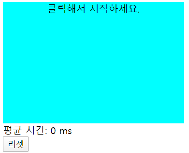
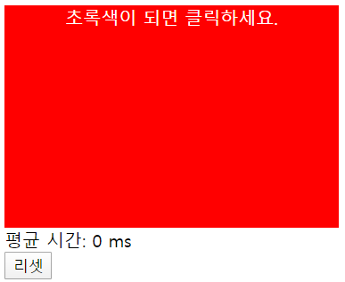
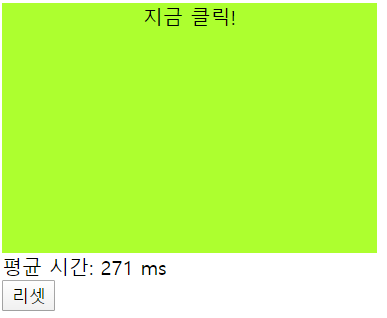

#pr4_v-bind

##1. Vue 문법
1. Vue component template
	- vue component의 template내부에는 최상위 div하나로 묶여야 한다.
	- 최상의 div이외에 레이아웃을 위한 모든 div들은 DOM간의 상하관계를 원치 않는다면 template 태그로 감쌀 수 있다.
	```javascript
    <template>
    	<div>
        	<div id="screen" v-bind:class="state" @click="onClickScreen">{{message}}</div>
        	<template v-show="result.length">
            	<div>평균 시간: {{average}} ms</div>
            	<button @click="onReset">리셋</button>
        	</template>
    	</div>
	</template>
    ```

2. v-on:click
	- 버튼 등을 클릭했을 때 이벤트를 발생시킬 수 있는데, 이때 v-on은 @로 대체하여 사용이 가능하다.
	```javascript
    <button @click="onReset">리셋</button>
    ```

3. v-show
	- v-if와 기능적으로는 동일하다. ""내부의 값이 참이면 화면에 표시해준다.
	- v-if는 값이 false면 태그 자체를 생성하지 않지만 v-show는 태그를 생성하고 display:none 속성을 적용한다.
	- 보통 v-if를 더 많이 사용한다.
	```javascript
    <template v-show="result.length">
    ```

4. css style scoped
	- vue 컴포넌트의 3 구성요소 중 하나인 style에서는 css를 정의할 수 있다.
	- 이 때, style scoped를 사용하면 해당 컴포넌트에만 css가 적용된다.
	- 보통 여러 컴포넌트를 한번에 사용하므로 css 중복을 막기 위해 scoped를 많이 사용한다.
	```javascript
    <style scoped>
    #screen{
        width: 300px;
        height: 200px;
        text-align: center;
        user-select: none;
    }
	</style>
    ```

5. computed
	- tmplate 내부의 자바스크립트 부분에서 계산을 해도 되지만 그렇게 한다면 페이지가 리로드 될때마다 같은 계산을 반복하게 된다.
	- 캐싱 기능을 지원하는 computed를 이용하여 계산값을 캐싱해둠으로써 메모리를 아낄 수 있다.
	```javascript
    export default {
    	computed: {
          average(){
              return this.result.reduce((a, c) => a + c, 0) / this.result.length || 0;
          }
        },
    }
    ```
    	- 여기서 || 뒤의 값은 초깃값.

##2. JS 문법
1. ruduce
	- 덧셈할 때 많이 사용함.
	- **배열.reduce((누적값, 현잿값, 인덱스, 요소) => { return 결과 }, 초깃값);** 이러한 형태로 많이 사용함
	```javascript
    this.result.reduce((a, c) => a + c, 0)
    ```


##3. 실행 화면
1. 초기 화면

2. 시작 화면

3. 결과 화면
