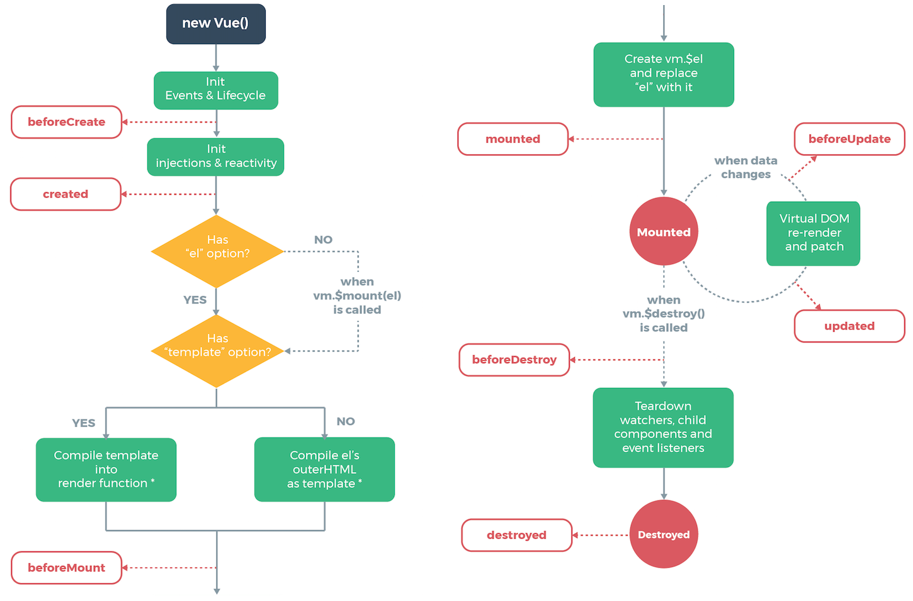

#Practice 5 - Life Cycle

##1. Vue 문법
1. v-bind
	- practice 2에서도 다루었지만 추가적인 부분이 있어서 기술한다.
	- v-bind 뒤의 ""내부에는 JS코드가 들어갈 수 있다고 했는데, 이 부분에 __객체__를 넣을 수도 있다.
	```html
    <div id="computer" :style="{ background: `url(https://en.pimg.jp/023/182/267/1/23182267.jpg) 0 0`"></div>
    ```
    - 위 sylte 내부의 객체에서는 css를 지정해주고 있는데 만약 background-color를 바꿔주고 싶다면 __JS에서는 -를 빼기로 인식__하기 때문에 backgroungColor와 같이 사용해야 한다.

2. coumputed
	- 템플릿 내부에 직접 JS 표현식을 넣어도 되지만, 복잡한 연산이면 컴포넌트가 불려질때마다 같은 연산을 반복한다.
	- 따라서 중복연산과 코드가 비대해지는 것을 방지하고 유지보수를 쉽게 하기 위해, 캐싱을 지원하는 coumputed라는 컴포넌트 속성을 이용한다.
	```javascript
    export default {
        data() {
            return{
            	imgCoord: '',
            }
        },
        computed: {
            computedStyleObject(){
                return { background: `url(https://en.pimg.jp/023/182/267/1/23182267.jpg) ${this.imgCoord} 0`,
                };
            },
        },
        methods: {
        }
    ```
    - 위와 같이 컴포넌트의 computed 속성 안에서 미리 계산을 하게 시킨다. 해당 값은 캐싱되어 동일한 계산을 중복 수행하지 않게 된다.
    - 여기서도 data의 값에 접근하기 위해서는 변수 앞에 __this__를 붙여주어야 한다.
    ```html
    <div id="computer" :style="computedStyleObject"></div>
    ```
    - template단에서는 위와 같이 computed된 값을 불러와 사용하기만 하면 된다.

3. __Vue Life Cycle__
	- Vue 인스턴스에는 라이프 사이클이 있고, created, mounted, updated, destroyed의 크게 총 4가지의 개념이 있다.

	1. created: 컴포넌트의 data, methods 등 모든 정보를 다 채워 넣은 상태. __아직 화면에 표시되지는 않는다.__
	2. mounted: created된 컴포넌트를 __화면에 나타낸 상태__. 보통 화면에 대한 컨트롤을 할 때에는 이 부분에서 수정한다.
	3. updated: 화면상의 컴포넌트가 변경됐을 때(__data가 바뀌어__ 다시 그려질 때).
	4. destroyed: 컴포넌트가 더이상 보이지 않을 때(사라졌을 때).
	- 각 lifecycle에는 before가 붙은 lifecylce이 추가로 존재한다(beforeCreat, beforeMount, beforeUpdate, beforeDestroy).
	- 그 중 beforeDestroy에서는 컴포넌트가 사라졌을 때, 불필요한 작업을 하지 않게 하는 코드를 넣어준다.
	```javascript
    <script>
    //이후에 컴포넌트가 종료되면 setInterval 작업을 종료시키기 위해
    //변수로 따로 선언함
    let interval = null;

    export default {
        data() {
            return{
            }
        },
        computed: {
        },
        methods: {
            changeHand(){
                interval = setInterval(() => {
                    if(this.imgCoord === rspCoords.바위){
                        this.imgCoord = rspCoords.가위;
                    }else if(this.imgCoord === rspCoords.가위){
                        this.imgCoord = rspCoords.보;
                    }else if(this.imgCoord === rspCoords.보){
                        this.imgCoord = rspCoords.바위;
                    }
                }, 100);
            },
        },
        //Lifecycle 4개
        created() {
            //컴포넌트가 화면에 나타나기 전, 생성될 때/ data, computed같은거 다 채워넣은 상태
            console.log('created');
        },
        mounted() {
            //컴포넌트가 화면에 나타난 후. 화면과 관련된 작업을 처리!!.
            console.log('mounted');
            this.changeHand();
        },
        destroyed() {
            //컴포넌트가 화면에서 사라질 때(없어질 때)
            console.log('destroyed');
        },
        beforeDestroy(){
            //mounted에서 interval 계속 실행시켰는데 setInterval이 컴포넌트가
            //종료되어도 계속 실행됨. 따라서 이런 쓸데없는 작업을 종료시켜준다.
            console.log('before destroyed');
            clearInterval(interval);
        },
    };
    </script>
    ```
    - mounted에서 실행한 changeHand 메소드가 계속해서 setInterval을 통해 그림을 바꿔주고 있는데, 이 작업이 컴포넌트가 사라져도 계속되기 때문에 beforeDestroy에서 clear해줌으로써 __memory leak을 방지__해준다.

##2. Javascript 문법
1. Object.entries: for...in과 같은 순서로 객체 내부의 [key,value] 쌍을 enumerate 속성으로 반환한다. 
2. find: 주어진 __판별함수를 만족__하는 __첫번째 요소__의 값을 반환한다.
```javascript
export default {
        data() {
            return{
                //나중에 봤을때 그냥 px만 넣으면 뭔지 모르니까 변수로 넣어주기
                imgCoord: rspCoords.바위,
                score: 0,
                result: '',
            }
        },
}
const rspCoords = {
        바위: '0',
        가위: '-142px',
        보: '-284px',
    };
const computerChoice = (imgCoord) => {
        return Object.entries(rspCoords).find(function (v) {
            return v[1] === imgCoord;
        })[0];
    };
```
3. includes: 배열이 특정 요소를 포함하고 있는지를 판단한다.
```javascript
[-1, 2].includes(diff)
```
diff라는 요소가 -1, 2 중에 있는지 판단.
4. setInterval: 일정 주기로 함수를 실행, setInterval(function() { ... }, 지연시간);와 같은 꼴로 사용한다.
```javascript
interval = setInterval(() => {
                    if(this.imgCoord === rspCoords.바위){
                        this.imgCoord = rspCoords.가위;
                    }else if(this.imgCoord === rspCoords.가위){
                        this.imgCoord = rspCoords.보;
                    }else if(this.imgCoord === rspCoords.보){
                        this.imgCoord = rspCoords.바위;
                    }
                }, 100);
```
위와 같이 사용하며, clearInterval(interval)로 멈출 수 있다.

##3. Dev-tools
- Chrome Extension으로써 Vue 프로그래밍에 도움이 되는 툴

- console.log를 찍지 않아도 데이터의 변화를 확인할 수 있다.
- Frame을 확인할 수 있는 부분이 있는데 보통 60 frame을 넘기도록 프로그래밍 해야 한다.

##4. 실행 화면
1. 초기 화면

2. 멈춤 화면

