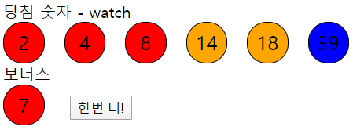

#pr6_watch

##1. Vue 개념
1. 추가 컴포넌트
	- LottoGenerator 컴포넌트 외에 LottoBall이라는 자식 컴포넌트를 만들어 내부에서 활용한다.
	- 컴포넌트를 만드는 방식은 같으며 부모 컴포넌트에서 자식 컴포넌트를 불러와 사용할 수 있다.

	####LottoGenerator.vue의 template 부분 
	```html
    <lotto-ball v-for="ball in winBalls" :key="ball" v-bind:number="ball"></lotto-ball>
    ```

	####LottoGenerator.vue의 script 부분 - 자식 컴포넌트 load
    ```javascript
    <script>
    import LottoBall from "./LottoBall";
    export default {
        components: {
            'lotto-ball': LottoBall
        },
    }
    </script>
    ```
    	- 위와 같이 자식 컴포넌트를 import하고 컴포넌트 내부의 components 속성을 이용하여 자식 컴포넌트를 가져온다.
    	- html코드 부분을 보면 불러온 컴포넌트를 태그형식으로 사용할 수 있으며, 부모측에서 파스칼 케이스로 컴포넌트를 불러오더라도 html 코드 내부에서 케밥 케이스로 자동변환해주어 사용이 가능하다.
2. props
	- 부모 컴포넌트에서 자식 컴포넌트로 data를 넘겨주면 그것을 받아서 사용하게 해준다.

	####LottoGenerator.vue의 template 부분
	```html
    <lotto-ball v-for="ball in winBalls" :key="ball" v-bind:number="ball"></lotto-ball>
    ```
    	- 자식 컴포넌트에 ball이라는 데이터를 'number'라는 이름으로 넘겨준다.

    ####LottoBall.vue의 template 부분
    ```html
    <template>
    <div class="ball" :style="background">{{number}}</div>
	</template>
    ```
    	- props로 받은 number를 그대로 자식 컴포넌트에서 사용한다.

	####LottoBall.vue의 script 부분
    ```javascript
    <script>
    export default {
        name: 'LottoBall',
        //props로 받은 변수로 바꾸는 것은 금지!!!(readonly)
        props: {
            number: Number,
        },
    }
    </script>
    ```
    	- 부모 컴포넌트에서 넘겨준 number를 props에서 받아준다. 이렇게 되면 자식 컴포넌트 내부에서 해당 값을 사용할 수 있게 된다.
    	- props로 데이터를 받을 때에는 __자료형__을 명시하도록 한다.
3. watch
	- 컴포넌트의 data를 감시하고 있다가 해당 데이터의 값이 변경되면 특정 행동을 하게 한다.
	```javascript
    data() {
            return{
                redo: false,
                winBalls: [],
                //winNumbers에 로또번호 7개 한번에 넣어놓고, 한개씩 순서대로 winBalls에 넘겨주면서 보여줌
                winNumbers: getWinNumbers(),
                bonus: null,
            }
        },
    watch: {
            //data의 winBalls를 감시
            winBalls(value, oldValue){
                console.log(value, oldValue);
                if(value.length === 0){
                    this.showBalls();
                }
            }
        },
    ```
    	- data내부 변수를 메소드의 형태로 써주면 해당 값의 변화를 감시하게 된다.
    	- computed와 비슷하지만 computed는 변수의 값이 바뀌면 계산된 하나의 값만 리턴한다.
    	- 최후의 수단으로 사용하며, 평소에는 사용을 지양해야 한다. (로직이 꼬일 수 있음!)
4. v-for
	- 기존에 학습했으나 v-for를 사용할 때에는 __:key__를 필수로 지정해야 한다는 것을 추가로 학습하였다.
	```html
    <lotto-ball v-for="ball in winBalls" :key="ball" v-bind:number="ball"></lotto-ball>
    ```
    	- 위와 같이 반복문으로 비슷한 값이 여러 개 생성될 때, 각 컴포넌트를 구분하기 위해 v-bind를 사용하여 key를 넣어준다.

##2. JS 개념
1. fill: 배열 내부를 하나의 수로 채우는 함수, 3가지의 형태로 쓰일 수 있다.
	```javascript
    const array = [1, 2, 3, 4]
    console.log(array1.fill(0, 2, 4))
    ```
    	- 파라미터로 3개의 값을 넘겨준 경우로써 2번째부터 4번째 값을 0으로 채운다.
    	- 결과값 -> [1, 2, 0, 0]

    ```javascript
    const array = [1, 2, 3, 4]
    console.log(array1.fill(5, 1))
    ```
    	- 파라미터로 2개의 값을 넘겨준 경우로써 1번째 index부터 5로 채운다.
    	- 결과값 -> [1, 5, 5, 5]

    ```javascript
    const array = [1, 2, 3, 4]
    console.log(array1.fill(6))
    ```
    	- 파라미터로 1개의 값을 넘겨준 경우로써 6으로 전부 채운다.
    	- 결과값 -> [6, 6, 6, 6]
	- 여기서는 다음과 같이 쓰였다.
	```javascript
    const candidate = Array(45).fill().map((v, i) => i + 1);
    ```
		- 45길이의 array를 1~45의 값으로 채운다.

2. sort: 배열의 요소를 ASCII 코드순으로 정렬한다.
```javascript
const winNumbers = shuffle.slice(0, 6).sort((p, c) => p - c);
```
	- 그냥 sort하면 숫자가 크기대로 정렬되지 않고 맨 앞자릿수의 수 크기별로 정렬되므로 숫자 크기대로 정렬되게 한다.

3. slice: 배열의 일부분을 잘라 새로운 배열을 만든다.
```javascript
const winNumbers = shuffle.slice(0, 6).sort((p, c) => p - c);
```
	- shuffle 배열의 앞에서 7개만큼 숫자를 잘라서 winNumbers에 저장한다.

4. forEach: 주어진 함수를 배열요소 각각에 대해 실행한다.
```javascript
timeouts.forEach((t) => {
	clearTimeout(t);
});
```

##3. 실행 화면
1. 초기 화면

2. 결과 화면
