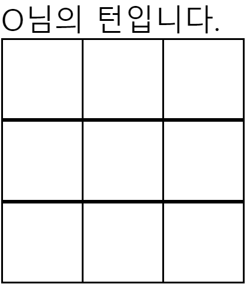
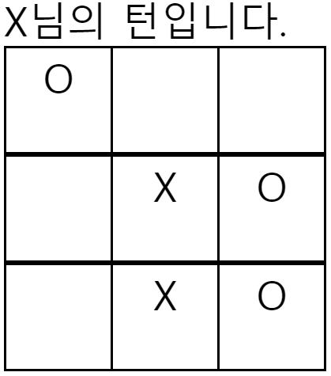
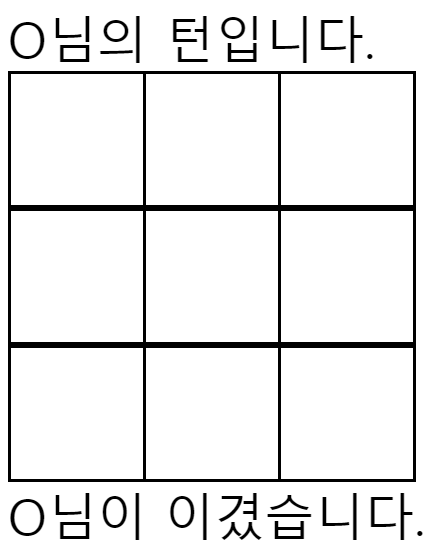

# Practice7 - array, $root, $set

##1. Vue 문법
	- 프로그램 구조: TicTacToc.vue -> TableComponent.vue -> TrComponent.vue -> TdComponent.vue 순서로 자식 컴포넌트를 가진다.
	- Table 자체를 하나의 컴포넌트로 설계한다면 칸 하나의 값이 바뀔 때 마다 Table 전체를 다시 랜더링 해야 하므로 리소스 낭비가 심하다.
	- 따라서 각 칸을 하나의 컴포넌트로 설계하여 자원 낭비를 막는다.

1. 부모 컴포넌트 Data 접근
	1. $root
		- 자식 컴포넌트에서 부모 컴포넌트의 Data(변수)에 접근할 때, 원래대로라면 컴포넌트 상하관계에 따라 데이터를 계속해서 내려보내줘야 한다.
		- $root를 사용하면 그러한 과정 없이 한번에 최상단 부모 컴포넌트의 값에 접근할 수 있고, 수정도 할 수 있다.

		####최상단 부모 컴포넌트 TicTacToe.vue의 data
		```javascript
        data() {
            return{
                tableData: [
                  ['', '', ''],
                  ['', '', ''],
                  ['', '', ''],
                ],
                turn: 'O',
                winner: '',
            };
        },
        ```
		#### 최하단 자식 컴포넌트 TdComponent.vue
		```javascript
        const rootData = this.$root.$data;
        ```
			- 위와 같이 $root를 사용하여 최상단 부모 컴포넌트에 접근하고 $data로 해당 컴포넌트의 데이터에 접근한다.

	2. $parent
		- 최상단 부모 컴포넌트 뿐만 아니라 바로 윗단의 부모 컴포넌트에 접근하기 위해 사용할 수 있다.
		- 컴포넌트 상하 관계가 복잡해질 수록 $parent가 많아지므로 Vuex를 통해 이 문제를 해결할 수 있다.
		```javascript
        this.$parent.$data
        ```

2. **Array 컨트롤**
	- Javascript의 태생적 한계로 인해 Array[1][3] 등과 같이 index로 배열에 접근하여 값을 수정하면 화면에 나타나지 않는다. 
	- 따라서 Vue에서 제공하는 Vue.set이나, this.$set을 사용하여 array의 값을 수정해 주어야만 화면에 반영이 된다.
	- 두 방법은 같은 방법이지만 표기법에 차이가 있는것 뿐이다.

	1. Vue.set
		```javascript
        <script>
        import Vue from './vue'
        Vue.set(rootData.tableData[this.rowIndex], this.cellIndex, rootData.turn);
        ```
        - Vue.set은 위와 같이 import를 한 후에 사용이 가능하며, parameter는 Vue.set(테이블 인덱스, 키(마지막 인덱스), 바꿀 값) 형태가 된다.
        - 예를 들어 array[0][1] 의 값을 3으로 바꾸고자 한다면 -> **Vue.set(array[0], 1, 3);** 과 같이 사용해야 한다.

	2. this.$set
		```javascript
        this.$set(rootData.tableData[this.rowIndex], this.cellIndex, rootData.turn);
        ```
		- Vue.set과 같은 기능을 하지만 따로 import를 해줄 필요가 없다. 
		- 사용 방법은 Vue.set과 같다.

##2. JS 문법
1. 삼항 연산자
	```javascript
    rootData.turn = rootData.turn === 'O' ? 'X' : 'O';
    ```
    - C의 문법과 유사하다.
    - 여기서는 rootData를 삼항 연산자의 결과로 할당하기 위해 삼항 연산자를 사용하였다.
    - (rootData.turn 이 'O'와 같다면) 'X'를 rootData.turn에 할당하고, 그렇지 않다면 'O'를 rootData.turn에 할당하는 코드이다.

##3. 실행 화면
1. 초기 화면

2. 진행 화면

3. 결과 화면
